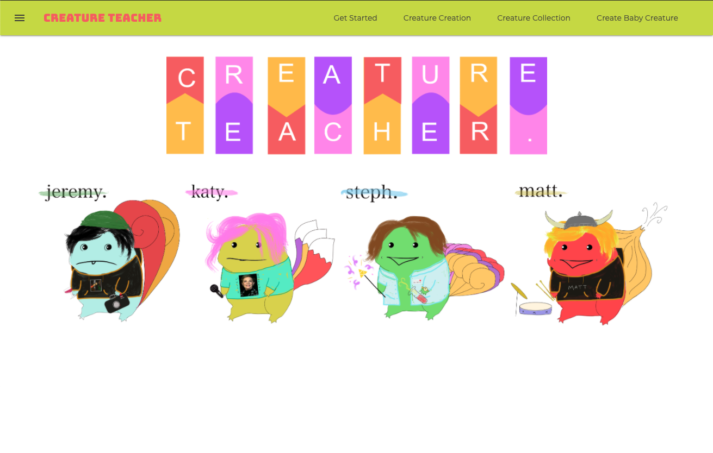
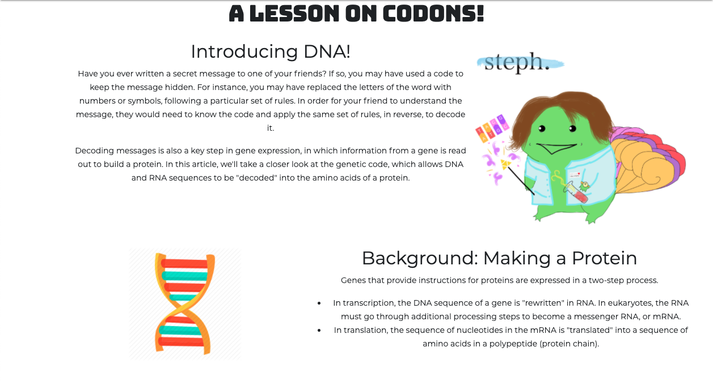
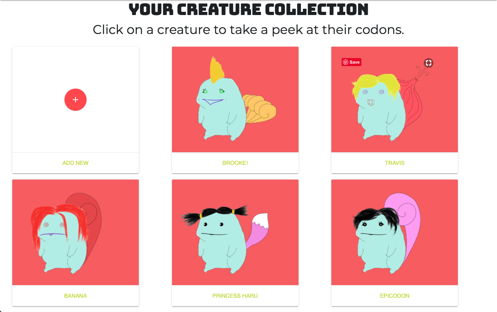

# _Creature Teacher_

#### By _**Jeremy Kale Padot, Steph Podolak, Matt Taylor, & Katy Wicz**_



## Description

_An ASP.NET Core MVC web application designed to teach young users about DNA and Codons by creating creatures and mixing their DNA._

## Application Usage

|                                                                    Page Preview                                                                     |                                                        Specification                                                        |                    Example Input                    |                                                 Example Output                                                 |
| :-------------------------------------------------------------------------------------------------------------------------------------------------: | :-------------------------------------------------------------------------------------------------------------------------: | :-------------------------------------------------: | :------------------------------------------------------------------------------------------------------------: |
|   |                             User can learn more about DNA and codons at the 'Get Started' Page                              |           User clicks 'Get Started' link            |                                      DNA and codon tutorial is displayed                                       |
|                                                               |                   User can create a creature by selecting codons which are assigned to creature features                    | User selects Eye TTT, Mouth ATT, Head CTT, Tail GTT |                        Selected Codens and Features are Assigned to your creature build                        |
|                                                        |                                         User can view catalog of created creatures                                          |          User clicks 'Creature Collection'          |                                       Catalog of creatures is displayed                                        |
|                                                                               |                           User can select creature from catalog to view codon and feature details                           |                User selects creature                |                               Creature image and codon / Features are displayed                                |
|                                                          |                     User can select two parent creatures from creatures that have already been created                      |       User selects Creature 1 and Creature 2        |                         Creature 1 and Creature 2 are displayed and ready to pass DNA                          |
|                                                                     | Computer generates a new baby creature by based off of the recessive and dominant genes of the user-chosen parent creatures |     User Clicks 'Breed Those Bad Mamma Jammas'      | A new baby creature is created and displayed containing features and codons inherited from the parent cratures |
|                                                                            |                                     Baby creature is now added to the creature catalog                                      |          User clicks 'Creature Collection'          |                            New baby creature is displayed the rest of the creatures                            |

## Setup/Installation Requirements

### 1. Install .NET Core

#### on macOS:

- [Click here](https://dotnet.microsoft.com/download/thank-you/dotnet-sdk-2.2.106-macos-x64-installer) to download a .NET Core SDK from Microsoft Corp.

#### on Windows:

- [Click here](https://dotnet.microsoft.com/download/thank-you/dotnet-sdk-2.2.203-windows-x64-installer) to download the 64-bit .NET Core SDK from Microsoft Corp.

#### Install dotnet script

Enter the command `dotnet tool install -g dotnet-script` in Terminal (macOS) or PowerShell (Windows).

### 2. Clone this repository

Enter the following commands in Terminal (macOS) or PowerShell (Windows):

```sh
cd desktop
git clone https://github.com/kwicz/CreatureTeacher.Solution
cd CreatureTeacher.Solution
```

### 3. Install all necessary packages and make sure the project will build

In your terminal, type the following commands to make sure all necessary packages are included in the project and to launch in your browser:

```sh
cd CreatureTeacher
dotnet restore
dotnet build
```

### 4. Update the database and tables

Enter the following to update your database and tables for the program:

```sh
dotnet ef database update
```

### 5. Launch the project in your browser

In your terminal, type:

```sh
dotnet watch run
```

Hold `command` while clicking the link in your local terminal to your local address, which should be:

```sh
http://127.0.0.1:5000
```

## Seed Creature Feature Data

1. Open MySQL WorkBench.
2. Navigate to the `Schema` tab.
3. Right click on `creature_teacher` and select `Table Data Import Wizard`.
4. Select `creature_teacher-eyes.utf8.csv` from the root directory of the project and click `Next`.
5. Select `Use existing table` and from the drop down, select `creature_teacher.eyes`. Click `Next`.
6. Confirm the data is correct and click `Next`.
7. Confirm executing the import and Make sure 16 lines were imported.
8. Repeat steps 3-7 for the mouth, head, and tails tables.
9. Congratulations! You have filled the features tables in the `creature_teacher` database that you can now query.

## Known Bugs

_No known bugs at this time._

## Support and contact details

_Have a bug or an issue with this application? [Open a new issue](https://github.com/kwicz/CreatureTeacher.Solution/issues) here on GitHub._

## Technologies Used

- _C#_
- _.NET Core 8.0_
- _ASP.NET Core MVC_
- _MySQL 8.0.0_
- _MySQL Workbench 8.0_
- _EF Core 8.0.0_
- _Razor 8.0.0_
- _Affinity Designer_
- _Docker_
- _Deployed with Fly.io_
- _[DNA Lessons from Khan Academy](https://www.khanacademy.org/science/biology/gene-expression-central-dogma/central-dogma-transcription/a/the-genetic-code-discovery-and-properties)_

## License

[MIT License](https://choosealicense.com/licenses/mit/)

Copyright (c) 2020 **_Team Creature Teacher_**
